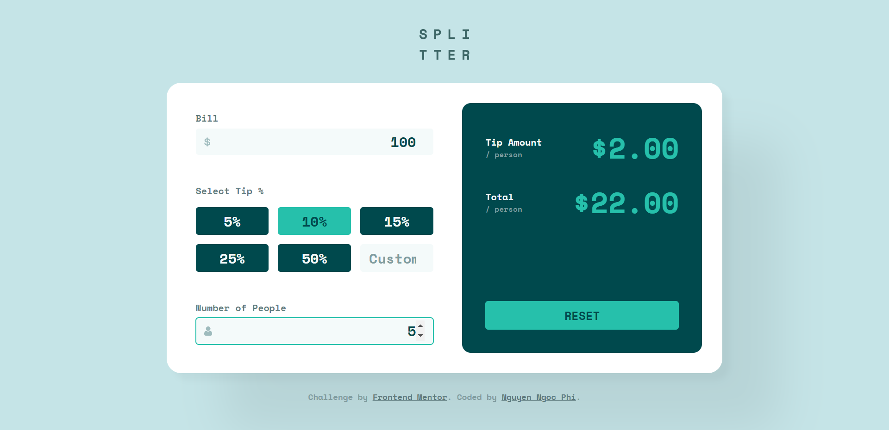

# Frontend Mentor - Tip calculator app solution

This is a solution to the [Tip calculator app challenge on Frontend Mentor](https://www.frontendmentor.io/challenges/tip-calculator-app-ugJNGbJUX).

## Table of contents

-   [Overview](#overview)
    -   [The challenge](#the-challenge)
    -   [Screenshot](#screenshot)
    -   [Links](#links)
-   [My process](#my-process)
    -   [Built with](#built-with)
    -   [What I learned](#what-i-learned)
    -   [Continued development](#continued-development)
-   [Author](#author)
-   [Acknowledgments](#acknowledgments)

## Overview

This is my second challenge on Frontend Mentor. This challenge requires me to build a Tip Calculator App that can calculate tip and total cost of bill person.

### The challenge

Users should be able to:

-   View the optimal layout for the app depending on their device's screen size
-   See hover states for all interactive elements on the page
-   Calculate the correct tip and total cost of the bill per person

### Screenshot



### Links

-   Solution URL: (https://www.frontendmentor.io/solutions/tip-calculator-app-zFaz8pCvb)
-   Live Site URL: (https://nngocphi.github.io/tip-calculator-app/)

## My process

-   Start challenge, download starter
-   Setup project: organize folder, create necessary files
-   Overview, analyze and start planning out
-   Specify reusable styles
-   Start building with HTML and SASS, mobile-first
-   Responsive
-   Add JavaScript
-   Demo
-   Complete, commit solution

### Built with

-   Semantic HTML5 markup
-   CSS custom properties
-   Flexbox
-   CSS Grid
-   SASS
-   Mobile-first workflow
-   JavaScript

### What I learned

```html
<div class="tip">
	<label>Select Tip %</label>
	<div class="tip__btn-container">
		<button class="btn">5%</button>
		<button class="btn">10%</button>
		<button class="btn">15%</button>
		<button class="btn">25%</button>
		<button class="btn">50%</button>
		<input type="number" class="tip__input" placeholder="Custom" />
	</div>
</div>
```

```sass
.bill,
.tip,
.people {
	label {
		@extend %label;
	}

	&__input {
	  @extend %input;
		}
	}

.bill,
.people {
  &__input-container {
    @extend %input-container;
  }

  &__icon {
    @extend %input__icon;
  }
}
```

```js
billInput.addEventListener('input', setBillValue);
tipBtns.forEach((btn) => {
	btn.addEventListener('click', handleClick);
});
tipCustom.addEventListener('input', setCustomTipValue);
peopleInput.addEventListener('input', setPeopleValue);
resetBtn.addEventListener('click', reset);
```

### Continued development

-   SASS
-   JavaScript -> ReactJS

## Author

-   Website - [Phi Nguyen](https://www.linkedin.com/in/nguyenngocphi/)
-   Frontend Mentor - [@nngocphi](https://www.frontendmentor.io/profile/nngocphi)

## Acknowledgments

Thanks to MRZ.Code.Manufacture (https://www.youtube.com/channel/UC8vDv2c3-wQfTnOr84CwH4Q), I learnt a lot from this channel about processes, SASS and JavaScript.
